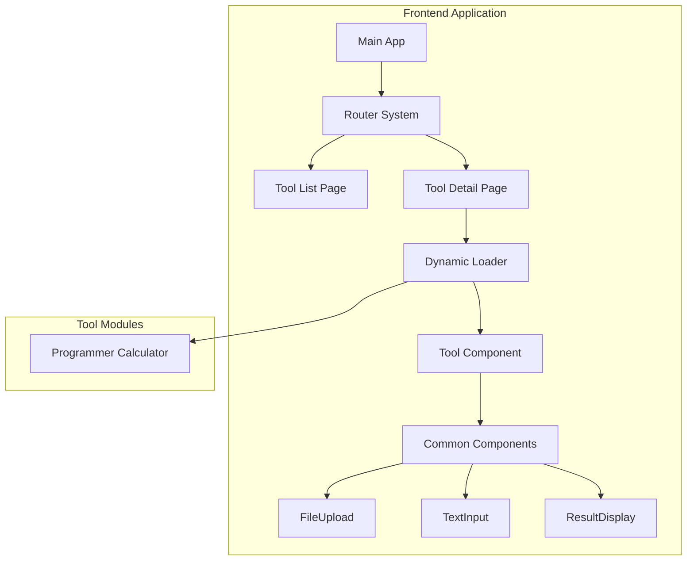
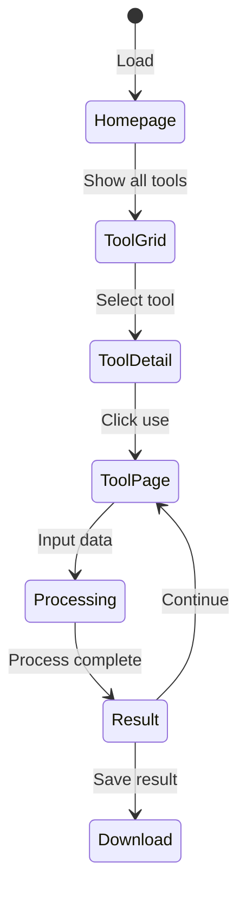

# Tool Suite Website - Design Specification

## Overview

A modern online tool collection website providing common development and office tools with privacy-first, frontend-only design supporting offline usage.

## Design Principles

### Core Values
- **Privacy First**: All data processing happens locally in the browser
- **Frontend Priority**: Basic functions work offline, advanced features optional
- **Zero Configuration**: Users need no software installation
- **Modular Architecture**: Independent tool development and loading
- **Progressive Enhancement**: Core functionality first, then advanced features

### User Experience Philosophy - "爽感" Design
- **Crisp Interactions (操作简洁)**: Minimal clicks, intuitive workflows, direct manipulation
- **Clear Display (显示清晰)**: High contrast, proper spacing, readable typography, visual hierarchy
- **Instant Feedback (反馈迅速)**: Immediate response to user actions, smooth animations, loading states
- **Responsive Excellence**: Fluid layouts, touch-friendly controls, adaptive interfaces across all devices
- **Effortless Operation**: Zero learning curve, self-explanatory interfaces, natural interaction patterns

### Design Execution Standards
- **Interaction Speed**: All UI responses < 100ms, visual feedback within 16ms
- **Visual Clarity**: Minimum 4.5:1 contrast ratio, 44px+ touch targets, clear affordances
- **Motion Design**: Purposeful animations (200-300ms), smooth transitions, reduced motion support
- **Responsive Fluidity**: Seamless adaptation from 320px to 4K displays
- **Cognitive Load**: Single-task focus, progressive disclosure, contextual help

### Technical Constraints
- First load: < 2 seconds
- Tool startup: < 1 second  
- File processing: ≤ 100MB files
- Memory limit: < 500MB per tool
- Browser support: Chrome 90+, Firefox 88+, Safari 14+, Edge 90+

## Technology Stack

### Core Framework
- **React 18.2.0**: UI framework
- **TypeScript 5.5+**: Type-safe JavaScript
- **Vite 6.3.5**: Modern build tool

### UI & Styling
- **Tailwind CSS 4.0**: Atomic CSS framework
- **shadcn/ui 2.5.0**: Reusable UI components
- **Radix UI**: Headless UI primitives

### Development Tools
- **ESLint**: Code quality
- **Prettier**: Code formatting
- **Vitest**: Unit testing
- **Husky**: Git hooks

## Project Structure

```
src/
├── app/                    # App router pages
├── components/
│   ├── ui/                # shadcn/ui components
│   ├── layout/            # Layout components
│   └── common/            # Reusable components
├── tools/                 # Tool implementations
│   ├── [tool-name]/
│   │   ├── ui.tsx         # Tool UI component
│   │   ├── toolInfo.ts    # Tool metadata
│   │   ├── lib.ts         # Tool logic (optional)
│   │   └── components/    # Tool-specific components (optional)
│   └── [tool-name]-specification.md  # Detailed tool design docs
├── lib/                   # Utilities and shared logic
├── hooks/                 # Custom React hooks
└── types/                 # TypeScript definitions
```

## MVP Tool List

**Programmer Calculator** - Complete calculator for developers featuring: refer to tools/programmer-calculator-specification.md

## Architecture Design

### System Overview



### Data Flow



## UI Design Specifications

### "爽感" Design Implementation

#### Interaction Design (操作简洁)
- **One-Click Actions**: Primary operations require single click/tap
- **Contextual Controls**: Tools and options appear near relevant content
- **Gesture Support**: Swipe, pinch, drag gestures on touch devices
- **Keyboard Shortcuts**: Power-user shortcuts for all common actions
- **Smart Defaults**: Intelligent pre-configuration to minimize user input

#### Visual Clarity (显示清晰)
- **Typography Hierarchy**: Clear distinction between H1-H6, body text
- **Spacing Rhythm**: Consistent 4px base unit for predictable layouts
- **Color Semantics**: Meaningful color usage (success, warning, error, info)
- **Icon Consistency**: Unified icon system with clear metaphors
- **Content Density**: Optimal information per screen without clutter

#### Instant Feedback (反馈迅速)
- **Micro-interactions**: Button press effects, hover states, focus indicators
- **Loading States**: Skeleton screens, progress bars, spinners with context
- **Success Confirmations**: Toast notifications, check marks, status updates
- **Error Handling**: Immediate validation feedback, clear error messages
- **System Status**: Always inform users about current state and progress

#### Responsive Excellence
- **Fluid Grids**: CSS Grid and Flexbox for adaptive layouts
- **Breakpoint Strategy**: Mobile-first design with progressive enhancement
- **Touch Optimization**: 44px+ targets, gesture zones, palm rejection
- **Content Reflow**: Intelligent content prioritization across screen sizes
- **Performance Scaling**: Adaptive quality based on device capabilities

### Homepage Layout

#### Structure
- **Left Sidebar (280px)**: Tool categories and search
- **Right Content**: Tool grid or detail panel
- **Responsive**: Collapsible sidebar on tablet, drawer on mobile

#### Category Navigation
```
Tool Categories
├── Search Box
├── All Tools (default)
└── Development Tools
    └── Programmer Calculator
```

#### Tool Card Design
- **Layout**: Uniform height cards with flexible content distribution
- **Height Consistency**: min-h-[280px] for standard mode, min-h-[200px] for compact mode
- **Icon**: Tool-specific icon in primary color container (48x48px standard, 32x32px compact)
- **Title**: Tool name with truncation support (H3 typography)
- **Description**: Multi-line text description (up to 3 lines with line-clamp)
- **Version Info**: Version number with NEW/FREE/PAID badges
- **Minimal Design**: Clean interface focusing on essential information only
- **Action**: Primary "Use Tool" button pinned to bottom with heart icon for favorites
- **Structure**: Flexbox layout ensuring content distribution and bottom alignment

### Tool Page Layout

#### Standard ToolLayout Structure
All tools must use the consistent `ToolLayout` wrapper with standardized spacing:

```typescript
<ToolLayout
  toolName={toolInfo.name}
  toolDescription={toolInfo.description}
  onClose={handleClose}
  onMinimize={handleMinimize}
  onFullscreen={handleFullscreen}
  isFullscreen={isFullscreen}
>
  <div className="w-full p-6 space-y-6 mt-5">
    {/* Tool content here */}
  </div>
</ToolLayout>
```

#### Layout Requirements
- **Top Margin**: `mt-5` (20px) to prevent interference with window controls
- **Padding**: `p-6` (24px) for consistent internal spacing
- **Vertical Spacing**: `space-y-6` (24px) between major sections
- **Grid Gaps**: `gap-6` (24px) for card layouts and column grids
- **Window Controls**: Right-top corner reserved for close/minimize/fullscreen buttons

#### Structure
- **Top Toolbar**: Back button, breadcrumb, title, settings
- **Main Workspace**: Input (40%) | Controls (20%) | Output (40%)
- **Responsive**: Vertical stack on mobile with tab switching

#### Input Area
- **File Upload**: Drag-drop zone with file type validation
- **Text Input**: Multi-line editor with syntax highlighting
- **Format Support**: Dynamic based on tool requirements

#### Control Panel
- **Process Button**: Primary action (full width, 48px height)
- **Reset Button**: Secondary action (clear all)
- **Parameters**: Tool-specific configuration options

#### Output Area
- **Text Results**: Syntax highlighted, scrollable
- **File Results**: Download button with file info
- **Image Results**: Preview with zoom controls
- **Actions**: Copy, download, share buttons

#### Layout Consistency Standards
- **Padding Unity**: All tools use `p-6` for main container padding
- **Spacing Harmony**: Consistent `gap-6` for grids, `space-y-6` for vertical stacks
- **Top Safety**: `mt-5` ensures window controls don't interfere with content
- **Responsive Grid**: `grid-cols-1 lg:grid-cols-3` for three-column layouts
- **Card Elevation**: Consistent card styling across all tools

### Tool-Specific Implementations

Each tool has its own detailed specification document located in the `tools/` directory. For example:
- **Programmer Calculator**: See `tools/programmer-calculator-specification.md`

#### Tool Layout Flexibility
- Each tool may have different layout requirements and component arrangements
- Tools can use any combination of the three main areas (Input, Controls, Output)
- Some tools may require custom layouts that don't follow the standard three-column pattern
- Tools should adapt their layout based on their specific functionality needs

#### Common Component Usage
The framework provides a set of common components that tools can leverage:

##### Framework-Provided Common Components
- **FileUpload**: Standardized file upload with drag-drop, validation, and progress
- **TextInput**: Multi-line text editor with syntax highlighting and formatting
- **ResultDisplay**: Unified result presentation with copy/download capabilities
- **CopyButton**: Consistent copy-to-clipboard functionality
- **LoadingSpinner**: Standardized loading states and progress indicators
- **ErrorBoundary**: Centralized error handling and user-friendly error display

##### When to Use Common Components
- **Consistency**: Use common components to maintain UI consistency across tools
- **Efficiency**: Leverage pre-built, tested components instead of rebuilding functionality
- **Maintenance**: Common components are centrally maintained and updated
- **Accessibility**: Common components include built-in accessibility features

##### Tool-Specific Components
Tools may also implement their own custom components when:
- Functionality is unique to that specific tool
- Standard components don't meet the tool's specific requirements
- Custom interaction patterns are needed for the tool's workflow

#### Component Integration Guidelines
```typescript
// Example: Tool using both common and custom components
import { Card } from '@/components/ui/card';           // shadcn/ui base
import { FileUpload } from '@/components/common/file-upload';  // Framework common
import { ResultDisplay } from '@/components/common/result-display'; // Framework common
import { CustomCalculatorGrid } from './components/calculator-grid'; // Tool-specific

export default function MyTool() {
  return (
    <Card>
      <FileUpload onFileSelect={handleFile} />      {/* Common component */}
      <CustomCalculatorGrid onCalculate={calc} />   {/* Tool-specific */}
      <ResultDisplay result={result} />             {/* Common component */}
    </Card>
  );
}
```

## Component Specifications

### Core Interface Types

```typescript
interface ToolInfo {
  id: string;
  name: string;
  description: string;
  category: 'development' | 'text' | 'file' | 'encode' | 'crypto' | 'image';
  tags: string[];
  requiresBackend: boolean;
  icon: React.ComponentType;
  path: string;
}

interface ToolPageState {
  toolId: string;
  processing: boolean;
  progress: number;
  error: string | null;
  inputType: 'text' | 'file';
  textInput: string;
  fileInput: File | null;
  params: Record<string, any>;
  output: {
    type: 'text' | 'file' | 'image';
    content: string | Blob;
    metadata?: Record<string, any>;
  } | null;
}
```

### Component Requirements with "爽感" Standards

#### FileUpload Component
- **Instant Visual Feedback**: Drag overlay appears within 16ms
- **Progress Excellence**: Real-time progress bars with ETA
- **Smart Validation**: Pre-upload format and size checking
- **Error Recovery**: Clear error states with retry options
- **Gesture Support**: Intuitive drag-drop with visual guides

#### TextInput Component
- **Real-time Features**: Live syntax highlighting, auto-completion
- **Responsive Editing**: Smooth scrolling, immediate character feedback
- **Smart Assistance**: Auto-resize, intelligent indentation
- **Visual Indicators**: Line numbers, character/word counts
- **Error Integration**: Inline validation with contextual hints

#### ResultDisplay Component
- **Instant Actions**: One-click copy, immediate download
- **Format Intelligence**: Auto-detect optimal display format
- **Preview Excellence**: Syntax highlighting, image previews
- **Share Integration**: Native share API support
- **Accessibility**: Screen reader friendly, keyboard navigable

## State Management

### Application State
```typescript
interface AppState {
  theme: 'light' | 'dark' | 'system';
  tools: ToolInfo[];
  currentTool: string | null;
  loading: boolean;
  error: string | null;
}
```

### Tool Registration
```typescript
// tools/programmer-calculator/toolInfo.ts
export const toolInfo: ToolInfo = {
  id: 'programmer-calculator',
  name: 'Programmer Calculator',
  description: 'Advanced calculator with base conversion and bitwise operations',
  category: 'development',
  tags: ['calculator', 'binary', 'hex', 'bitwise', 'programming'],
  requiresBackend: false,
  icon: CalculatorIcon,
  path: '/tools/programmer-calculator'
}
```

## Styling Guidelines

### Design System with "爽感" Focus
- **Colors**: High-contrast semantic tokens from shadcn/ui
- **Typography**: Inter for crisp UI readability, JetBrains Mono for code
- **Spacing**: Consistent 4px rhythm for visual harmony
- **Radius**: 0.5rem for modern, friendly appearance
- **Shadows**: Subtle depth without visual noise
- **Animations**: 200-300ms smooth transitions for all interactions

### Component Styling Standards
- **Tailwind Priority**: Utility-first approach for consistency
- **Responsive Excellence**: Mobile-first with progressive enhancement
- **Dark Mode Native**: Seamless theme switching without flicker
- **Accessibility First**: WCAG 2.1 AA compliance minimum
- **Touch Friendly**: 44px+ target sizes, gesture-optimized spacing

### Layout Spacing Standards
- **Tool Container**: `p-6 space-y-6 mt-5` for all ToolLayout content wrappers
- **Grid Systems**: `gap-6` for card grids, `gap-4` for form elements
- **Vertical Rhythm**: `space-y-6` for major sections, `space-y-4` for related content
- **Window Safety**: `mt-5` top margin to avoid window control interference
- **Responsive Breakpoints**: `grid-cols-1 lg:grid-cols-3` for three-column layouts
- **Card Consistency**: Uniform spacing and padding across all tool cards

### Theme Integration
```css
:root {
  --background: 0 0% 100%;
  --foreground: 222.2 84% 4.9%;
  --primary: 221.2 83.2% 53.3%;
  --border: 214.3 31.8% 91.4%;
  --radius: 0.5rem;
  --duration-fast: 150ms;
  --duration-normal: 200ms;
  --duration-slow: 300ms;
}
```

## Performance Strategy - "爽感" Optimization

### Speed Excellence (反馈迅速)
- **Interaction Response**: < 100ms for all UI feedback
- **Animation Smoothness**: 60fps for all transitions
- **Loading Intelligence**: Skeleton screens, progressive loading
- **Caching Strategy**: Aggressive caching for repeat operations
- **Bundle Optimization**: Critical CSS inline, lazy-loaded components

### Code Splitting Excellence
- **Dynamic Imports**: Tool components loaded on-demand
- **Route Optimization**: Page-level code splitting
- **Dependency Intelligence**: Heavy libraries loaded conditionally
- **Progressive Enhancement**: Core features first, enhancements later

### Memory Management for Smoothness
- **Cleanup Excellence**: Automatic cleanup of all resources
- **Large Object Handling**: Streaming for big file operations
- **Memory Monitoring**: Performance budgets and alerts
- **Cancellation Tokens**: User-initiated operation cancellation

### Caching Strategy for Speed
- **Browser Optimization**: Aggressive static asset caching
- **Component Caching**: Memoized expensive operations
- **Search Intelligence**: Instant search result caching
- **User Preferences**: Persistent, fast preference storage

## Error Handling - "爽感" Error Experience

### Error Categories with Immediate Feedback
1. **Input Errors**: Real-time validation with helpful suggestions
2. **Processing Errors**: Clear progress indication with graceful failure
3. **Output Errors**: Smart retry mechanisms with user control

### Error Display Excellence
- **Contextual Clarity**: Errors appear exactly where problems occur
- **Solution-Focused**: Clear recovery steps, not just problem description
- **Visual Hierarchy**: Color, typography, and spacing guide user attention
- **Graceful Degradation**: Partial functionality when full features fail
- **Emotional Design**: Friendly tone, reassuring messaging

### Error Prevention
- **Proactive Validation**: Check inputs before submission
- **Smart Defaults**: Reduce error-prone user decisions
- **Progressive Disclosure**: Reveal complexity gradually
- **Undo Capabilities**: Safety net for destructive actions

## Accessibility - Universal "爽感"

### Keyboard Navigation Excellence
- **Predictable Patterns**: Consistent tab order across all tools
- **Skip Navigation**: Jump to main content, tool functions
- **Keyboard Shortcuts**: Power-user efficiency without mouse
- **Focus Management**: Clear, visible focus indicators
- **Escape Routes**: Always provide way back/out

### Screen Reader Optimization
- **Semantic Structure**: Proper heading hierarchy, landmarks
- **Live Regions**: Announce dynamic content changes
- **Descriptive Labels**: Context-rich ARIA labels
- **Status Updates**: Progress, errors, success communicated clearly
- **Content Structure**: Logical reading order, meaningful groups

### Visual Accessibility Standards
- **Contrast Excellence**: WCAG 2.1 AA minimum (4.5:1)
- **Scalable Interface**: 200% zoom without horizontal scrolling
- **Color Independence**: Never rely solely on color for meaning
- **Motion Control**: Respect prefers-reduced-motion settings
- **Focus Visibility**: High-contrast focus indicators

### Motor Accessibility
- **Large Targets**: 44px minimum for touch interfaces
- **Gesture Alternatives**: Always provide button alternatives
- **Timing Flexibility**: No time limits on user interactions
- **Error Tolerance**: Forgiving input validation

## Development Rules - Code "爽感"

### Code Standards for Developer Experience
- **Language**: English exclusively for all code, comments, documentation
- **No Chinese**: Absolutely no Chinese characters in code, variables, functions, comments, or UI text
- **TypeScript Excellence**: Strict typing, comprehensive interfaces
- **React Best Practices**: Functional components, hooks, named exports
- **File Consistency**: Kebab-case files, clear naming patterns

### Layout Code Standards
- **ToolLayout Wrapper**: All tools must use standardized ToolLayout component
- **Container Classes**: Consistent `w-full p-6 space-y-6 mt-5` for main content div
- **Grid Patterns**: Use `grid-cols-1 lg:grid-cols-3 gap-6` for three-column layouts
- **Responsive Design**: Mobile-first approach with `lg:` breakpoint prefixes
- **Spacing Consistency**: Follow established spacing hierarchy (gap-6, space-y-6, mt-5)
- **Class Order**: Width → Positioning → Spacing → Layout → Visual properties

### Import Organization for Clarity
```typescript
// 1. React and external libraries
import React from 'react'
import { useState } from 'react'

// 2. Internal UI components
import { Button } from '@/components/ui/button'

// 3. Internal components and hooks
import { FileUpload } from '@/components/common/file-upload'

// 4. Utilities and types
import { cn } from '@/lib/utils'
import type { ToolInfo } from '@/types/tool'
```

### Testing Requirements for Quality Assurance
- **Unit Tests**: >90% coverage for utility functions
- **Component Tests**: Rendering, interactions, edge cases
- **Accessibility Tests**: Automated a11y testing
- **Performance Tests**: Speed benchmarks, memory usage
- **User Experience Tests**: Real user testing scenarios

### Quality Assurance Pipeline
- **ESLint + Prettier**: Code consistency and formatting
- **Pre-commit Hooks**: Quality gates before commits
- **Automated Testing**: CI/CD pipeline with comprehensive tests
- **Performance Monitoring**: Real-time performance tracking
- **User Feedback**: Continuous improvement based on usage data

### Code Review Checklist
- [ ] "爽感" principles implemented (简洁、清晰、迅速、responsive)
- [ ] TypeScript types properly defined and strict
- [ ] Components follow naming and structure conventions
- [ ] Error handling comprehensive and user-friendly
- [ ] Accessibility features present and tested
- [ ] Performance optimizations implemented
- [ ] Tests written and passing with good coverage
- [ ] Documentation updated and accurate
- [ ] Responsive design tested across devices
- [ ] Dark mode support functional
- [ ] No Chinese characters anywhere in code
- [ ] **Layout Standards**: ToolLayout wrapper used with `p-6 space-y-6 mt-5`
- [ ] **Spacing Consistency**: Grid gaps and vertical spacing follow standards
- [ ] **Window Controls**: Top margin ensures no interference with toolbar buttons
- [ ] **Responsive Grid**: Three-column layouts use `grid-cols-1 lg:grid-cols-3`

---

**Design Philosophy**: Create tools that feel instantly responsive, visually clear, and effortlessly usable - delivering the satisfying "爽感" experience that makes users want to return. Every interaction should feel smooth, every interface should guide naturally, and every response should be immediate.