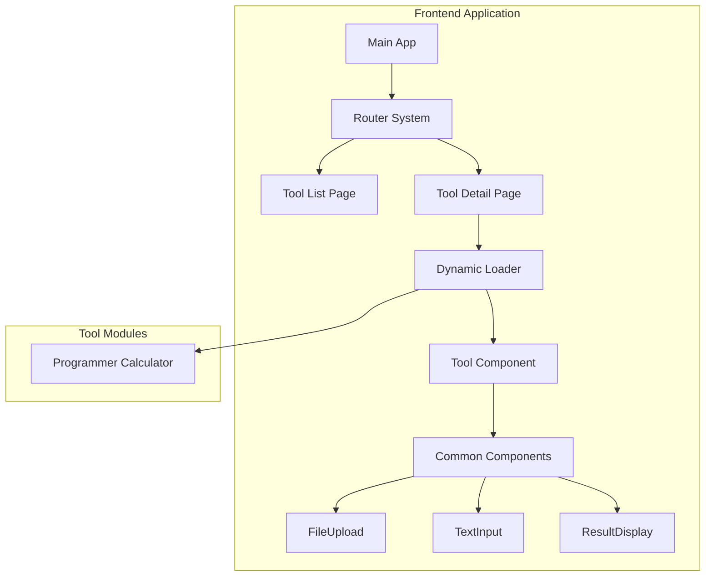
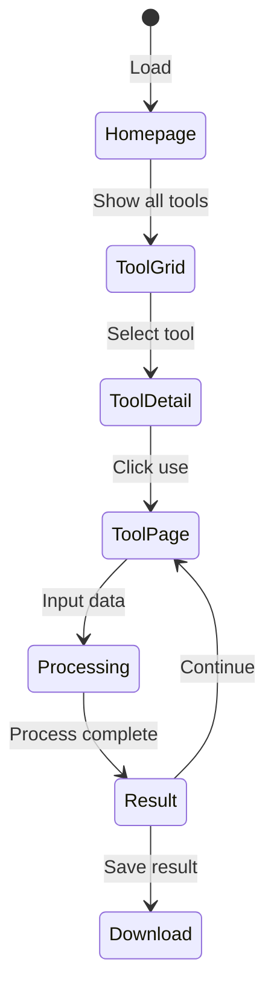

# Tool Suite Website - Design Specification

## Overview

A modern online tool collection website providing common development and office tools with privacy-first, frontend-only design supporting offline usage.

## Design Principles

### Core Values
- **Privacy First**: All data processing happens locally in the browser
- **Frontend Priority**: Basic functions work offline, advanced features optional
- **Zero Configuration**: Users need no software installation
- **Modular Architecture**: Independent tool development and loading
- **Progressive Enhancement**: Core functionality first, then advanced features

### Technical Constraints
- First load: < 2 seconds
- Tool startup: < 1 second  
- File processing: ≤ 100MB files
- Memory limit: < 500MB per tool
- Browser support: Chrome 90+, Firefox 88+, Safari 14+, Edge 90+

## Technology Stack

### Core Framework
- **React 18.2.0**: UI framework
- **TypeScript 5.5+**: Type-safe JavaScript
- **Vite 6.3.5**: Modern build tool

### UI & Styling
- **Tailwind CSS 4.0**: Atomic CSS framework
- **shadcn/ui 2.5.0**: Reusable UI components
- **Radix UI**: Headless UI primitives

### Development Tools
- **ESLint**: Code quality
- **Prettier**: Code formatting
- **Vitest**: Unit testing
- **Husky**: Git hooks

## Project Structure

```
src/
├── app/                    # App router pages
├── components/
│   ├── ui/                # shadcn/ui components
│   ├── layout/            # Layout components
│   └── common/            # Reusable components
├── tools/                 # Tool implementations
│   ├── [tool-name]/
│   │   ├── ui.tsx         # Tool UI component
│   │   ├── toolInfo.ts    # Tool metadata
│   │   ├── lib.ts         # Tool logic (optional)
│   │   └── components/    # Tool-specific components (optional)
│   └── [tool-name]-specification.md  # Detailed tool design docs
├── lib/                   # Utilities and shared logic
├── hooks/                 # Custom React hooks
└── types/                 # TypeScript definitions
```

## MVP Tool List

**Programmer Calculator** - Complete calculator for developers featuring: refer to tools/programmer-calculator-specification.md

## Architecture Design

### System Overview



### Data Flow



## UI Design Specifications

### Homepage Layout

#### Structure
- **Left Sidebar (280px)**: Tool categories and search
- **Right Content**: Tool grid or detail panel
- **Responsive**: Collapsible sidebar on tablet, drawer on mobile

#### Category Navigation
```
Tool Categories
├── Search Box
├── All Tools (default)
└── Development Tools
    └── Programmer Calculator
```

#### Tool Card Design
- **Layout**: Uniform height cards with flexible content distribution
- **Height Consistency**: min-h-[280px] for standard mode, min-h-[200px] for compact mode
- **Icon**: Tool-specific icon in primary color container (48x48px standard, 32x32px compact)
- **Title**: Tool name with truncation support (H3 typography)
- **Description**: Multi-line text description (up to 3 lines with line-clamp)
- **Version Info**: Version number with NEW/FREE/PAID badges
- **Minimal Design**: Clean interface focusing on essential information only
- **Action**: Primary "Use Tool" button pinned to bottom with heart icon for favorites
- **Structure**: Flexbox layout ensuring content distribution and bottom alignment

### Tool Page Layout

#### Structure
- **Top Toolbar**: Back button, breadcrumb, title, settings
- **Main Workspace**: Input (40%) | Controls (20%) | Output (40%)
- **Responsive**: Vertical stack on mobile with tab switching

#### Input Area
- **File Upload**: Drag-drop zone with file type validation
- **Text Input**: Multi-line editor with syntax highlighting
- **Format Support**: Dynamic based on tool requirements

#### Control Panel
- **Process Button**: Primary action (full width, 48px height)
- **Reset Button**: Secondary action (clear all)
- **Parameters**: Tool-specific configuration options

#### Output Area
- **Text Results**: Syntax highlighted, scrollable
- **File Results**: Download button with file info
- **Image Results**: Preview with zoom controls
- **Actions**: Copy, download, share buttons

### Tool-Specific Implementations

Each tool has its own detailed specification document located in the `tools/` directory. For example:
- **Programmer Calculator**: See `tools/programmer-calculator-specification.md`

#### Tool Layout Flexibility
- Each tool may have different layout requirements and component arrangements
- Tools can use any combination of the three main areas (Input, Controls, Output)
- Some tools may require custom layouts that don't follow the standard three-column pattern
- Tools should adapt their layout based on their specific functionality needs

#### Common Component Usage
The framework provides a set of common components that tools can leverage:

##### Framework-Provided Common Components
- **FileUpload**: Standardized file upload with drag-drop, validation, and progress
- **TextInput**: Multi-line text editor with syntax highlighting and formatting
- **ResultDisplay**: Unified result presentation with copy/download capabilities
- **CopyButton**: Consistent copy-to-clipboard functionality
- **LoadingSpinner**: Standardized loading states and progress indicators
- **ErrorBoundary**: Centralized error handling and user-friendly error display

##### When to Use Common Components
- **Consistency**: Use common components to maintain UI consistency across tools
- **Efficiency**: Leverage pre-built, tested components instead of rebuilding functionality
- **Maintenance**: Common components are centrally maintained and updated
- **Accessibility**: Common components include built-in accessibility features

##### Tool-Specific Components
Tools may also implement their own custom components when:
- Functionality is unique to that specific tool
- Standard components don't meet the tool's specific requirements
- Custom interaction patterns are needed for the tool's workflow

#### Component Integration Guidelines
```typescript
// Example: Tool using both common and custom components
import { Card } from '@/components/ui/card';           // shadcn/ui base
import { FileUpload } from '@/components/common/file-upload';  // Framework common
import { ResultDisplay } from '@/components/common/result-display'; // Framework common
import { CustomCalculatorGrid } from './components/calculator-grid'; // Tool-specific

export default function MyTool() {
  return (
    <Card>
      <FileUpload onFileSelect={handleFile} />      {/* Common component */}
      <CustomCalculatorGrid onCalculate={calc} />   {/* Tool-specific */}
      <ResultDisplay result={result} />             {/* Common component */}
    </Card>
  );
}
```

## Component Specifications

### Core Interface Types

```typescript
interface ToolInfo {
  id: string;
  name: string;
  description: string;
  category: 'development' | 'text' | 'file' | 'encode' | 'crypto' | 'image';
  tags: string[];
  requiresBackend: boolean;
  icon: React.ComponentType;
  path: string;
}

interface ToolPageState {
  toolId: string;
  processing: boolean;
  progress: number;
  error: string | null;
  inputType: 'text' | 'file';
  textInput: string;
  fileInput: File | null;
  params: Record<string, any>;
  output: {
    type: 'text' | 'file' | 'image';
    content: string | Blob;
    metadata?: Record<string, any>;
  } | null;
}
```

### Component Requirements

#### FileUpload Component
- Drag-drop support
- File type validation
- Size limit checking
- Progress indication
- Error handling

#### TextInput Component
- Syntax highlighting
- Line numbers
- Character counting
- Auto-resize
- Error states

#### ResultDisplay Component
- Multiple content types
- Copy/download actions
- Format switching
- Syntax highlighting

## State Management

### Application State
```typescript
interface AppState {
  theme: 'light' | 'dark' | 'system';
  tools: ToolInfo[];
  currentTool: string | null;
  loading: boolean;
  error: string | null;
}
```

### Tool Registration
```typescript
// tools/programmer-calculator/toolInfo.ts
export const toolInfo: ToolInfo = {
  id: 'programmer-calculator',
  name: 'Programmer Calculator',
  description: 'Advanced calculator with base conversion and bitwise operations',
  category: 'development',
  tags: ['calculator', 'binary', 'hex', 'bitwise', 'programming'],
  requiresBackend: false,
  icon: CalculatorIcon,
  path: '/tools/programmer-calculator'
}
```

## Styling Guidelines

### Design System
- **Colors**: Semantic color tokens from shadcn/ui
- **Typography**: Inter for UI, monospace for code
- **Spacing**: 4px base unit (0.25rem)
- **Radius**: Consistent border radius (0.5rem)
- **Shadows**: Subtle elevation system

### Component Styling
- Use Tailwind utilities over custom CSS
- Follow responsive patterns: sm:, md:, lg:, xl:
- Support dark mode with CSS variables
- Ensure accessibility contrast ratios

### Theme Integration
```css
:root {
  --background: 0 0% 100%;
  --foreground: 222.2 84% 4.9%;
  --primary: 221.2 83.2% 53.3%;
  --border: 214.3 31.8% 91.4%;
  --radius: 0.5rem;
}
```

## Performance Strategy

### Code Splitting
- Dynamic imports for tool components
- Route-based code splitting
- Lazy loading of heavy dependencies

### Memory Management
- Clean up event listeners
- Dispose large objects
- Monitor memory usage
- Implement cancellation tokens

### Caching Strategy
- Browser cache optimization
- Tool component caching
- Search result caching
- User preference storage

## Error Handling

### Error Categories
1. **Input Errors**: Invalid format, size limit, missing data
2. **Processing Errors**: Parse failure, conversion error, timeout
3. **Output Errors**: Generation failure, download error, copy failure

### Error Display
- Contextual error messages
- Clear problem description
- Actionable recovery options
- Graceful degradation

## Accessibility

### Keyboard Navigation
- Tab order: Search → Categories → Tools → Actions
- Arrow keys for navigation
- Enter/Space for activation
- Escape for dismissal

### Screen Reader Support
- ARIA labels for complex components
- Semantic HTML structure
- Status announcements
- Descriptive link text

### Visual Accessibility
- High contrast support
- Scalable fonts
- Color-independent indicators
- Focus indicators

## Development Rules

### Code Standards
- **Language**: Use English exclusively for all code, comments, documentation, and user-facing text
- **No Chinese**: Absolutely no Chinese characters in code, variable names, function names, comments, or UI text
- **TypeScript**: Strict typing with proper interfaces and type definitions
- **React**: Functional components with hooks, named exports preferred
- **File Naming**: Consistent kebab-case for files and folders

### Import Organization
```typescript
// 1. React and external libraries
import React from 'react'
import { useState } from 'react'

// 2. Internal UI components
import { Button } from '@/components/ui/button'

// 3. Internal components and hooks
import { FileUpload } from '@/components/common/file-upload'

// 4. Utilities and types
import { cn } from '@/lib/utils'
import type { ToolInfo } from '@/types/tool'
```

### Testing Requirements
- Unit tests for utility functions
- Component rendering tests
- User interaction tests
- Accessibility tests
- Performance benchmarks

### Quality Assurance
- ESLint + Prettier configuration
- Pre-commit hooks
- Automated testing pipeline
- Code review process
- Performance monitoring

---

**Design Philosophy**: Clean, efficient, accessible tools that respect user privacy and work reliably across all devices. 